<p align="center">
  
</p>

[](https://www.rust-lang.org/)
[](https://ebpf.io/)
[](coverage/html/index.html)
[](#2-ingress-packet-evaluation-flow)
[](#-key-capabilities)
[](https://aya-rs.dev/)
[](https://github.com/rkyv/rkyv)
[](LICENSE)

An ultra-low-latency ingress firewall built entirely in **Rust** 🦀 using the [Aya](https://aya-rs.dev/) framework. It inspects and filters network traffic directly at the Network Interface Card (NIC) driver level via **eXpress Data Path (XDP)** ⚡, long before the Linux kernel network stack allocates a socket buffer (`sk_buff`).

The firewall natively integrates the [FireHOL IPsets repository](https://github.com/firehol/blocklist-ipsets), synchronizing millions of malicious IP addresses and CIDR subnets directly into kernel eBPF maps with zero-downtime hot reloading, automated cron updates, and an on-disk zero-copy cache powered by **rkyv** and **RocksDB**.

---

## 📑 Table of Contents

- [⚡ Key Capabilities](#-key-capabilities)
- [🏗️ Architecture & Ingress Packet Flow](#️-architecture--ingress-packet-flow)
  - [1. Overall Architecture](#1-overall-architecture)
  - [2. Ingress Packet Evaluation Flow](#2-ingress-packet-evaluation-flow)
  - [3. FireHOL Cron Synchronization Sequence](#3-firehol-cron-synchronization-sequence)
- [🗄️ eBPF Map Data Structures](#️-ebpf-map-data-structures)
- [📁 Repository Structure](#-repository-structure)
- [🔧 Prerequisites & Setup](#-prerequisites--setup)
- [🔨 Building the Project](#-building-the-project)
- [🚀 Running the Firewall](#-running-the-firewall)
  - [1. Basic Startup](#1-basic-startup)
  - [2. Production Startup (Static Rules + Watcher + Cron + Metrics)](#2-production-startup-static-rules--watcher--cron--metrics)
  - [3. Key CLI Arguments](#3-key-cli-arguments)
- [📝 Static Rule File Format](#-static-rule-file-format)
- [🧪 Testing & Benchmarks](#-testing--benchmarks)
  - [🛠️ Running Test and Benchmark Commands](#️-running-test-and-benchmark-commands)
  - [📊 Code Coverage & Dynamic Badge](#-code-coverage--dynamic-badge)
- [📊 Observability (Prometheus & Grafana)](#-observability-prometheus--grafana)
  - [1. 📈 Prometheus Metrics Catalog & Labels](#1--prometheus-metrics-catalog--labels)
  - [2. 🖥️ Grafana Dashboard & Visualizations](#2-️-grafana-dashboard--visualizations)
- [🐳 Docker Compose Deployment](#-docker-compose-deployment)
  - [1. 🌐 Network Topology & Services](#1--network-topology--services)
  - [2. 📋 Environment Variables in `docker-compose.yml`](#2--environment-variables-in-docker-composeyml)
  - [3. 🚀 Quickstart Commands](#3--quickstart-commands)
- [⚡ Performance & XDP Modes](#-performance--xdp-modes)
  - [🔌 XDP Attach Modes](#-xdp-attach-modes)
  - [🏎️ Key Optimizations Implemented](#️-key-optimizations-implemented)
  - [🗄️ FireHOL Import Memory & Zero-Copy Architecture](#️-firehol-import-memory--zero-copy-architecture)
- [📜 License](#-license)

---

## ⚡ Key Capabilities

* 🚀 **Driver-Level Line-Rate Filtering (XDP)**: Discards malicious traffic at wire speed (tens of millions of packets per second, Mpps) before kernel stack memory allocation.
* 🎯 **Dual-Tier Lookup Architecture**:
  * **Tier 1 (Exact Match)**: $O(1)$ constant-time lookup via `BPF_MAP_TYPE_HASH` for individual `/32` (IPv4) and `/128` (IPv6) addresses.
  * **Tier 2 (CIDR Subnets)**: Longest Prefix Match via `BPF_MAP_TYPE_LPM_TRIE` for arbitrary CIDR ranges (`10.0.0.0/8`, `2001:db8::/32`).
* 🌐 **Turnkey FireHOL Threat Intelligence**: Automated shallow Git synchronization with [firehol/blocklist-ipsets](https://github.com/firehol/blocklist-ipsets), classifying threats by category (*attacks*, *malware*, *botnet*, *spam*, *abuse*, etc.).
* 🗄️ **RocksDB Cache & rkyv Zero-Copy Deserialization**: Compressed (LZ4) on-disk cache for large threat metadata with instantaneous, zero-allocation deserialization using [rkyv](https://github.com/rkyv/rkyv).
* ⏰ **Automated Cron Scheduler**: Built-in periodic scheduler (`tokio-cron-scheduler`, default: hourly `0 0 * * * *`) executing atomic differential map updates without service interruption.
* 📬 **Lockless Ring Buffer Telemetry**: Discard events stream from kernel to user space via `BPF_MAP_TYPE_RINGBUF` with exact 64-byte cache-line alignment.
* 🔄 **Live Hot Reloading**: Watches static rule files (`notify`) and applies differential updates immediately to eBPF tables.
* 📊 **Full Observability Stack**: Embedded Prometheus exporter (`/metrics`) exposing packet counters, a memory-bounded Top 100 attacker leaderboard, and a pre-configured 69-panel Grafana dashboard.

---

## 🏗️ Architecture & Ingress Packet Flow

### 1. Overall Architecture

<p align="center">
  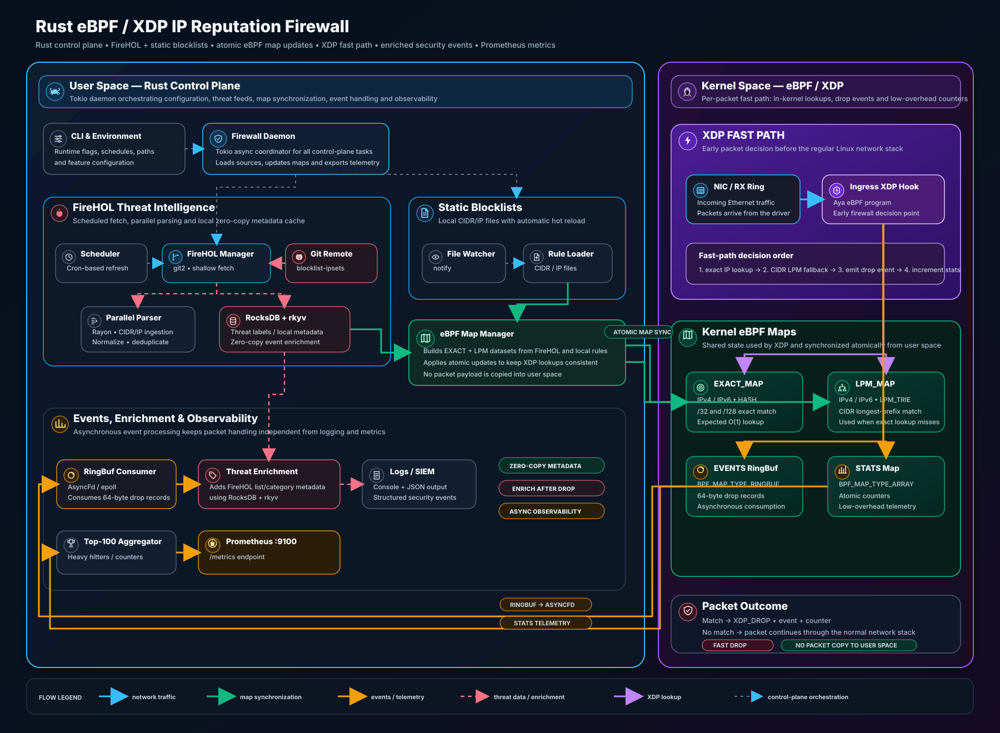
</p>

<details>
<summary>👁️ <b>Click to view Mermaid diagram source</b></summary>

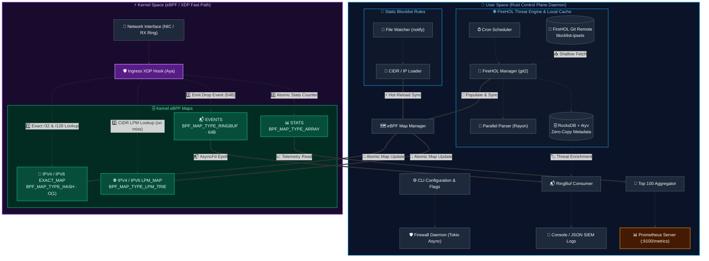

</details>

### 2. Ingress Packet Evaluation Flow

<p align="center">
  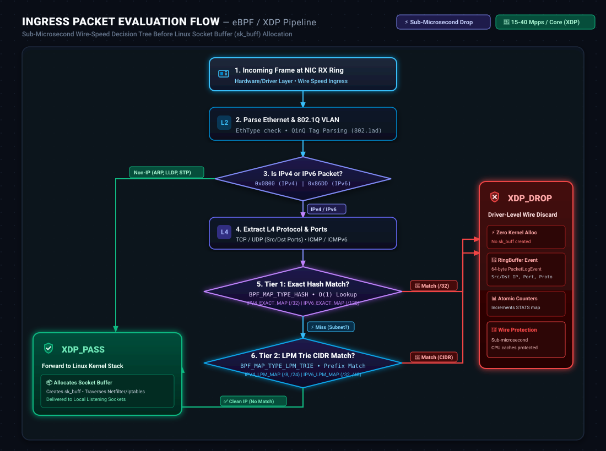
</p>

<details>
<summary>👁️ <b>Click to view Mermaid diagram source</b></summary>

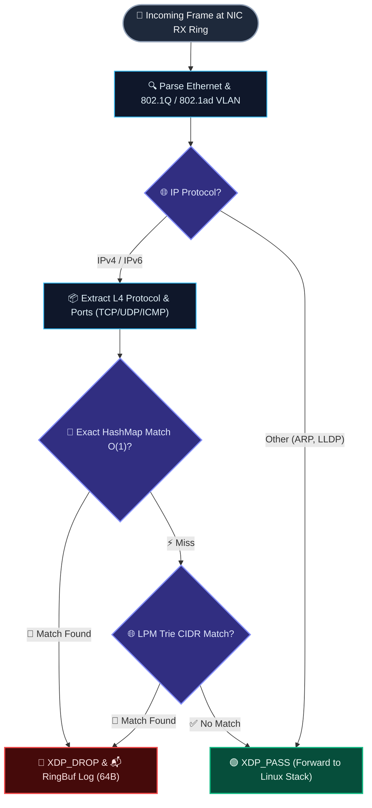

</details>

### 3. FireHOL Cron Synchronization Sequence

<p align="center">
  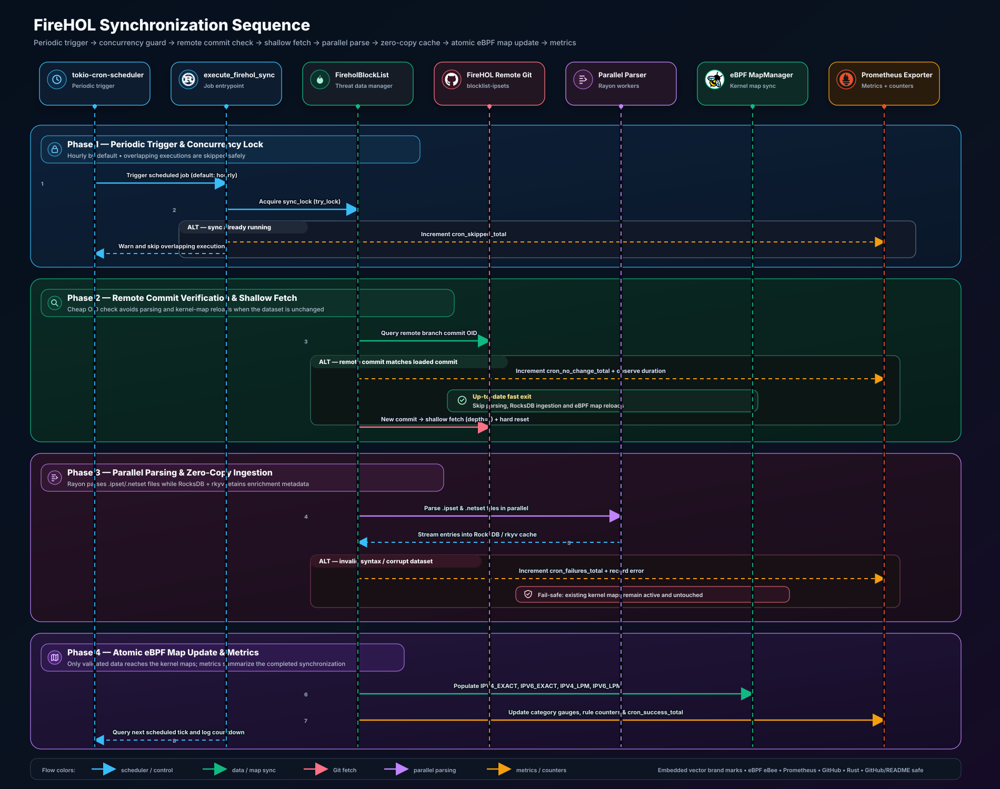
</p>

<details>
<summary>👁️ <b>Click to view Mermaid diagram source</b></summary>

```mermaid
sequenceDiagram
    autonumber
    actor Cron as ⏰ tokio-cron-scheduler
    actor Exec as 🚀 execute_firehol_sync
    actor Fh as 🌐 FireholBlockList
    actor Git as 🐙 FireHOL Remote Git
    actor Parser as 📑 Parallel Parser (Rayon)
    actor Maps as 🗺️ eBPF MapManager
    actor Prom as 📊 Prometheus Exporter

    rect rgb(15, 23, 42)
        Note over Cron,Exec: ⏰ Phase 1: Periodic Trigger & Concurrency Lock
        Cron->>Exec: ⏰ Trigger scheduled job (Default: Hourly)
        Exec->>Fh: 🔒 Acquire sync_lock (try_lock)
        alt Another sync is already in progress
            Exec-->>Prom: ⚠️ Increment cron_skipped_total
            Exec-->>Cron: 🛑 Log warning and skip overlapping execution
        end
    end

    rect rgb(15, 40, 30)
        Note over Fh,Git: 🐙 Phase 2: Remote Commit Verification & Shallow Fetch
        Fh->>Git: 🔍 Query remote branch commit OID
        alt Remote commit matches loaded commit & rules active
            Fh-->>Prom: ⏱️ Increment cron_no_change_total & record duration
            Note over Fh,Exec: ✨ Up-to-date: Skip parsing and map reloads
        else New commit detected upstream
            Fh->>Git: 📥 Git shallow fetch (depth=1) & hard reset
        end
    end

    rect rgb(40, 15, 40)
        Note over Fh,Parser: 📑 Phase 3: Parallel Parsing & Zero-Copy Ingestion
        Fh->>Parser: 📑 Parse .ipset & .netset files in parallel (Rayon)
        Parser->>Fh: 🗄️ Stream zero-copy entries into RocksDB (rkyv)
        alt Invalid syntax or corrupt dataset
            Fh-->>Prom: ❌ Increment cron_failures_total & record error
            Note over Fh,Maps: 🛡️ Resilient Fail-Safe: Existing kernel maps preserved
        end
    end

    rect rgb(30, 20, 50)
        Note over Fh,Maps: 🚀 Phase 4: Atomic eBPF Map Update & Metrics
        Fh->>Maps: 🔄 Populate IPV4_EXACT, IPV6_EXACT, IPV4_LPM, IPV6_LPM
        Fh->>Prom: 📊 Update category gauges, rule counters & cron_success_total
        Exec-->>Cron: ⏳ Query next scheduled tick and log countdown
    end
```

</details>

---

## 🗄️ eBPF Map Data Structures

<p align="center">
  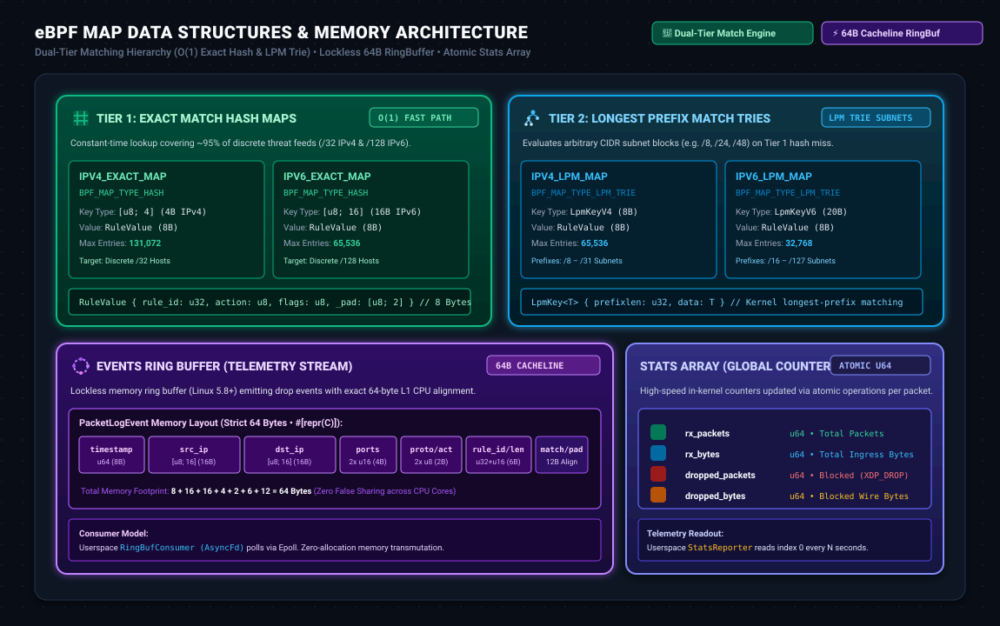
</p>

| eBPF Map 🏷️ | Kernel Type ⚙️ | Key Type 🔑 | Value Type 📦 | Max Entries 📊 | Purpose 🎯 |
| :--- | :--- | :--- | :--- | :--- | :--- |
| `IPV4_EXACT_MAP` | `BPF_MAP_TYPE_HASH` | `[u8; 4]` | `RuleValue` | 131,072 | $O(1)$ fast path lookup for single IPv4 addresses (`/32`) |
| `IPV6_EXACT_MAP` | `BPF_MAP_TYPE_HASH` | `[u8; 16]` | `RuleValue` | 65,536 | $O(1)$ fast path lookup for single IPv6 addresses (`/128`) |
| `IPV4_LPM_MAP` | `BPF_MAP_TYPE_LPM_TRIE` | `LpmKey<[u8; 4]>` | `RuleValue` | 65,536 | Longest Prefix Match for IPv4 CIDR blocks (e.g. `/8`, `/24`) |
| `IPV6_LPM_MAP` | `BPF_MAP_TYPE_LPM_TRIE` | `LpmKey<[u8; 16]>` | `RuleValue` | 32,768 | Longest Prefix Match for IPv6 CIDR blocks (e.g. `/32`, `/48`) |
| `EVENTS` | `BPF_MAP_TYPE_RINGBUF` | N/A | `PacketLogEvent` | 512 KiB | Lockless drop telemetry stream (64 bytes aligned to CPU cache line) |
| `STATS` | `BPF_MAP_TYPE_ARRAY` | `u32` | `FirewallStats` | 1 | Global high-speed counters (packets, bytes, drops) |

---

## 📁 Repository Structure

```text
eBPF-ip-reputation-firewall/
├── Cargo.toml                  # Workspace Cargo manifest
├── Makefile                    # Build, test, docker, and benchmark orchestration
├── Dockerfile                  # Multi-stage container build with BuildKit caching
├── docker-compose.yml          # Firewall + Traffic-Gen + Prometheus + Grafana stack
├── firewall-common/            # Shared #[no_std] crate (PacketLogEvent, RuleValue, Stats)
├── firewall-ebpf/              # Kernel XDP program (compiled with nightly rustc + bpf-linker)
├── src/                        # Rust user-space control daemon (FireHOL, sync, metrics)
│   ├── main.rs                 # CLI entrypoint and orchestrator
│   ├── cache_rocksdb.rs        # Persistent RocksDB cache with zero-copy rkyv serialization
│   ├── maps.rs                 # eBPF map lifecycle manager
│   ├── ringbuf.rs              # Asynchronous Ring Buffer event consumer
│   ├── metrics.rs              # Prometheus metrics server and exporter
│   ├── top_n.rs                # Top 100 attacker ranking with dynamic eviction
│   └── firehol/                # FireHOL engine (Git shallow sync, Rayon parser, cron scheduler)
├── rules/                      # Sample static rule files (blocklist.txt, cidr_ranges.txt)
├── tests/                      # Integration test suite (kernel, RingBuffer, FireHOL, cron)
├── benches/                    # Criterion benchmarks (eBPF lookup, FireHOL parser, RocksDB rkyv)
└── scripts/                    # High-throughput synthetic traffic testing and benchmarking tools
    ├── test_traffic/           # Multi-protocol validator (TCP/UDP/ICMP)
    └── benchmark/              # Extreme line-rate packet generator
```

---

## 🔧 Prerequisites & Setup

1. 🐧 **Linux Kernel**: Version **5.8+** (required for `BPF_MAP_TYPE_RINGBUF` and `BPF_MAP_TYPE_LPM_TRIE`).
2. 🦀 **Rust**: Stable (1.85+) and Nightly (for eBPF compilation).
3. 🔗 **`bpf-linker`**: eBPF LLVM linker for Rust (`cargo install bpf-linker --version 0.11.1`).
4. 🧱 **musl-cross Toolchain (Optional - Static Build)**: Available at [musl.cc](https://musl.cc/x86_64-linux-musl-cross.tgz), extract to `~/.local/x86_64-linux-musl-cross`.

Install packages on Debian / Ubuntu:
```bash
sudo apt-get update
sudo apt-get install -y clang llvm libclang-dev g++ pkg-config libelf-dev libssl-dev git make
rustup toolchain install nightly --component rust-src
cargo install bpf-linker --version 0.11.1
```

---

## 🔨 Building the Project

The `Makefile` automates compiling both kernel and user-space components:

```bash
# 🏗️ Full build (static musl binary by default)
make build

# 🦀 Dynamic native build (glibc with RocksDB LTO via Clang)
make BUILD_STATIC=OFF build

# 🎯 Individual targets:
make build-ebpf        # eBPF bytecode (target/bpfel-unknown-none/release/firewall-ebpf)
make build-userspace   # User-space daemon (target/release/firewall)
```

---

## 🚀 Running the Firewall

XDP driver attachment requires elevated privileges (`CAP_NET_ADMIN`, `CAP_BPF`, or `sudo`):

### 1. Basic Startup

```bash
# Listen on interface eth0 with automated FireHOL synchronization
sudo target/release/firewall --iface eth0
```

### 2. Production Startup (Static Rules + Watcher + Cron + Metrics)

```bash
sudo target/release/firewall \
    --iface eth0 \
    --rules rules/blocklist.txt \
    --rules rules/blocklist_v6.txt \
    --rules rules/cidr_ranges.txt \
    --mode auto \
    --watch \
    --firehol-cron "0 0 * * * *" \
    --stats-interval 5
```

### 3. Key CLI Arguments

| CLI Argument ⚙️ | Environment Variable 🏷️ | Default | Description 📋 |
| :--- | :--- | :--- | :--- |
| `-i, --iface <IFACE>` | `FIREWALL_IFACE` | `lo` | Target network interface (`eth0`, `ens3`, etc.) |
| `-r, --rules <FILE>` | `FIREWALL_RULES` | `rules/blocklist.txt` | Paths to static blocklist rule files |
| `-m, --mode <MODE>` | `FIREWALL_MODE` | `auto` | XDP attach mode: `auto`, `driver`, `generic`, `hardware` |
| `-w, --watch` | `FIREWALL_WATCH` | `false` | Watches and live-reloads static rule files |
| `--json` | `FIREWALL_JSON` | `false` | Emits drop logs in structured JSON (SIEM-ready) |
| `--firehol` / `--no-firehol`| `FIREWALL_ENABLE_FIREHOL` | `true` | Enables or disables FireHOL synchronization |
| `--firehol-cron <CRON>` | `FIREHOL_UPDATE_CRON` | `0 0 * * * *` | Cron expression for periodic updates |
| `--metrics-listen-addr <ADDR>` | `METRICS_LISTEN_ADDRESS` | `0.0.0.0:9100` | Prometheus HTTP metrics listen address (`/metrics`) |
| `--stats-interval <SEC>` | `FIREWALL_STATS_INTERVAL` | `5` | Console throughput statistics refresh interval |

---

## 📝 Static Rule File Format

Rule files accept single IPv4/IPv6 addresses, CIDR blocks, and inline/full-line comments:

```ini
# Exact host addresses (Tier 1 - O(1) BPF HashMap)
198.51.100.14       # Mirai Botnet scanning node
203.0.113.42        # Cobalt Strike C2 server
203.0.113.195/32    # /32 notation: automatically classified as exact match
2001:db8:ffff::1    # Known IPv6 scanner

# CIDR subnets (Tier 2 - BPF LPM Trie)
198.51.100.0/24     # Suspicious ASN prefix
10.0.0.0/8          # Bogon / internal ingress block
2001:db8:bad::/48   # Malicious IPv6 hosting provider
```

---

## 🧪 Testing & Benchmarks

The project is backed by an extensive automated test suite and high-precision benchmark harness covering kernel eBPF packet parsing, user-space synchronization logic, RocksDB storage, and zero-copy `rkyv` serialization:

* 🧪 **139 Automated Tests** (138 passing unit/integration tests):
  * **Core Daemon Unit Tests (60 tests)**: RocksDB cache management, Prometheus metrics counters, Top 100 attacker tracking & eviction, live config watcher, RingBuffer polling, and Rayon FireHOL parser logic.
  * **Integration Test Suites (36 tests)**: End-to-end integration tests in `tests/` validating rule compilation, FireHOL shallow Git sync, cron scheduler intervals, and atomic rule namespace isolation.
  * **Kernel & Common Data Structures (23 tests)**: 13 kernel-space packet parsing tests in `firewall-ebpf` (Ethernet, VLAN 802.1Q, QinQ, IPv4/IPv6, TCP/UDP/ICMP) and 10 shared data structure tests in `firewall-common`.
  * **Traffic Generator & Simulation Tests (19 tests)**: Packet construction, protocol headers, statistical aggregators, and CLI helpers across `scripts/common`, `scripts/benchmark`, and `scripts/test_traffic`.
* ⚡ **44 Criterion Micro-Benchmarks** (across 5 benchmark suites):
  * **`rocksdb_benchmark` (16 benchmarks)**: `rkyv` zero-copy serialization/deserialization, RocksDB pinned zero-copy reads, bulk write batches, and end-to-end cache roundtrips.
  * **`common_benchmark` (10 benchmarks)**: LPM trie keys (`LpmKeyV4`/`V6`), `RuleValue` constructors, `PacketLogEvent` zero-copy memory transmutation, and atomic stats increments.
  * **`ebpf_benchmark` (9 benchmarks)**: In-kernel bounds-check verification, raw Ethernet/VLAN/QinQ parsing, IPv4/IPv6 header classification, and exact match simulation.
  * **`firehol_benchmark` (5 benchmarks)**: IP/CIDR string parsing, `/32` exact match fast-path optimization, date normalization, and Rayon multi-threaded directory ingestion.
  * **`lookup_benchmark` (4 benchmarks)**: $O(1)$ BPF HashMap lookups, CIDR network parsing, IPv4 address resolution, and raw RingBuffer zero-copy transmutation.
* 🚀 **1 High-Speed Synthetic Traffic Benchmark**: Multi-threaded line-rate packet generator (`scripts/benchmark/`) leveraging raw `AF_PACKET` sockets to stress-test the live firewall at wire speed.

### 🛠️ Running Test and Benchmark Commands

```bash
# 🧪 Run all 139 unit and integration tests across workspace and eBPF
make test

# ⚡ Run all 44 Criterion micro-benchmarks (RocksDB, rkyv, eBPF lookups, FireHOL parser)
make bench-micro

# 🛡️ Validate multi-protocol filtering (TCP/UDP/ICMP) inside Docker
make test-traffic

# 🚀 Stress-test with extreme line-rate packet injection
make bench BENCH_ARGS="--duration 10s --connections 500"

# 📑 Generate detailed HTML code coverage report and update README badge
make code-coverage
```

### 📊 Code Coverage & Dynamic Badge

The project provides an end-to-end code coverage pipeline powered by Mozilla's [`grcov`](https://github.com/mozilla/grcov) and LLVM source-based code coverage (`-C instrument-coverage`).

#### 1. 🔧 Prerequisites & Tooling Installation
Code coverage calculation requires:
* **`llvm-tools-preview`**: Rust toolchain component providing LLVM profiling tools (`llvm-profdata`, `llvm-cov`).
* **`grcov`**: High-performance coverage aggregator generating detailed HTML reports and line-by-line analyses.

The `make code-coverage` command **automatically checks and installs** these prerequisites if they are not already installed on your system. You can also install them manually:

```bash
# 1. Install LLVM coverage tools for the Rust toolchain
rustup component add llvm-tools-preview

# 2. Install grcov
cargo install grcov
```

#### 2. 🚀 Generating Code Coverage
Run the dedicated Makefile target:

```bash
make code-coverage
```

This automated rule:
1. **Cleans stale profiling data**: Deletes previous `.profraw` traces and old coverage reports to prevent historical runs from skewing the results.
2. **Instruments test execution**: Runs both the workspace test suite and eBPF kernel program tests with `RUSTFLAGS="-C instrument-coverage"`, `CARGO_INCREMENTAL=0`, and `LLVM_PROFILE_FILE` targeting a clean trace directory.
3. **Aggregates coverage metrics with `grcov`**: Parses all profraw files, cross-references debug binaries, and ignores third-party dependencies, test harnesses, benchmarks, and build scripts.
4. **Produces detailed HTML reports**: Generates an interactive HTML dashboard in `coverage/` (`coverage/html/index.html`).
5. **Dynamically updates the README badge**: Calculates the exact global percentage and color thresholds, then updates the Shields.io badge at the top of `README.md`.

#### 3. 📑 Locating and Viewing the HTML Report
The complete report is written to:

```text
coverage/html/index.html   (also accessible via coverage/index.html)
```

You can view it directly in your browser:

```bash
# Open in default browser (Linux)
xdg-open coverage/html/index.html

# Or start a quick HTTP viewer
python3 -m http.server --directory coverage 8080
```

The HTML report provides:
* **Global coverage percentage**: Aggregated line and branch coverage across all active modules.
* **Per-file coverage table**: Exact executable lines, hit counts, and coverage percentages for every source file.
* **Line-by-line visualization**: Direct source code view with green (executed) vs. red (uncovered) lines, allowing immediate identification of untested functions, edge cases, and error branches.

#### 4. 🏷️ Dynamic Badge Calculation & Color Mapping
The Shields.io badge at the top of `README.md` displays the real coverage percentage obtained from the test suite:

```markdown
[](coverage/html/index.html)
```

The color adapts automatically according to the coverage tier:
* 🟢 **`brightgreen` / `green`** ($\ge 80\%$ / $\ge 70\%$): High test coverage.
* 🟡 **`yellow` / `orange`** ($\ge 60\%$ / $\ge 50\%$): Moderate test coverage.
* 🔴 **`red`** ($< 50\%$): Low test coverage.

---

## 📊 Observability (Prometheus & Grafana)

The firewall automatically exposes Prometheus metrics on `http://0.0.0.0:9100/metrics`.

### 1. 📈 Prometheus Metrics Catalog & Labels

#### 🎯 Top 100 Blocked IP Metrics
| Metric Name 🏷️ | Type 📊 | Labels 🏷️ | Description 📋 |
| :--- | :--- | :--- | :--- |
| `firewall_blocked_ip_packets` | Counter | `ip`, `protocol` | Blocked packets per attacker IP and protocol (`tcp`, `udp`, `icmp`, etc.) |
| `firewall_blocked_ip_bytes` | Counter | `ip`, `protocol` | Blocked wire volume in bytes per attacker IP and protocol |
| `firewall_blocked_ip_total_packets` | Counter | `ip` | Total blocked packets across all protocols for the Top 100 attacker IP |
| `firewall_blocked_ip_total_bytes` | Counter | `ip` | Total blocked wire bytes across all protocols for the Top 100 attacker IP |
| `firewall_top_blocked_ips_count` | Gauge | _None_ | Current count of actively tracked attacker IPs in the Top 100 list (0-100) |

#### 🗺️ eBPF Map Entries & Rule Telemetry
| Metric Name 🏷️ | Type 📊 | Labels 🏷️ | Description 📋 |
| :--- | :--- | :--- | :--- |
| `firewall_map_entries` | Gauge | `map`, `ip_version`, `entry_type` | Number of active elements currently loaded in eBPF maps |
| `firewall_rules_active` | Gauge | `map_type` | Breakdown of active blocking rules by map (`exact_v4`, `exact_v6`, `lpm_v4`, `lpm_v6`) |
| `firewall_rules_total` | Gauge | _None_ | Aggregate total of active reputation blocklist rules across all kernel maps |
| `firewall_rule_sync_duration_seconds` | Histogram | _None_ | Latency distribution of eBPF map synchronization and differential updates |

#### 🚦 Traffic Counters & Daemon Health
| Metric Name 🏷️ | Type 📊 | Labels 🏷️ | Description 📋 |
| :--- | :--- | :--- | :--- |
| `firewall_up` | Gauge | _None_ | Service health indicator (`1` = running, `0` = stopped) |
| `firewall_build_info` | Gauge | `version`, `git_ref`, `aya_version` | Daemon version, compile-time Git hash, and Aya metadata |
| `firewall_packets_total` | Counter | `action` | Ingress packets evaluated by XDP (`action="accept"` vs `action="drop"`) |
| `firewall_packets_blocked_total` | Counter | `protocol`, `match_type` | Blocked packets categorized by protocol and match engine (`Exact HashMap`, `LPM Trie`) |
| `firewall_packets_accepted_total` | Counter | _None_ | Allowed packets forwarded to the Linux host network stack |
| `firewall_bytes_total` | Counter | `action` | Total network bytes processed by XDP (`accept` vs `drop`) |
| `firewall_ringbuf_events_total` | Counter | _None_ | Audit events consumed from the eBPF Ring Buffer |
| `firewall_errors_total` | Counter | `error_type` | Daemon operational errors (`sync`, `ringbuf_poll`, `ringbuf_malformed`) |

#### 🌐 FireHOL Threat Intelligence & Cron Scheduler Metrics
| Metric Name 🏷️ | Type 📊 | Labels 🏷️ | Description 📋 |
| :--- | :--- | :--- | :--- |
| `firewall_firehol_total_entries` | Gauge | _None_ | Total raw IP and CIDR threat rules parsed from FireHOL blocklists |
| `firewall_firehol_loaded_files` | Gauge | _None_ | Total number of valid `.ipset` and `.netset` blocklist files processed |
| `firewall_firehol_cron_executions_total` | Counter | _None_ | Total periodic synchronization runs triggered by tokio-cron-scheduler |
| `firewall_firehol_cron_success_total` | Counter | _None_ | Successful cron synchronization runs updating kernel eBPF maps |
| `firewall_firehol_cron_no_change_total` | Counter | _None_ | Cron runs where upstream Git was unchanged (redundant reload skipped) |
| `firewall_firehol_cron_failures_total` | Counter | _None_ | Total failed FireHOL synchronizations triggered by cron |
| `firewall_firehol_cron_last_error` | Gauge | _None_ | Health status of the last cron execution (`1` = failure, `0` = healthy) |
| `firewall_firehol_cron_last_duration_seconds` | Gauge | _None_ | Wall-clock execution duration in seconds of the latest FireHOL sync |
| `firewall_firehol_cron_last_success_timestamp_seconds` | Gauge | _None_ | Unix epoch timestamp of the last successful FireHOL reload |
| `firewall_firehol_git_errors_total` | Counter | _None_ | Total network, Git, or filesystem errors during sync operations |

#### 🗄️ RocksDB Cache & FireHOL Import Metrics
| Metric Name 🏷️ | Type 📊 | Labels 🏷️ | Description 📋 |
| :--- | :--- | :--- | :--- |
| `firewall_firehol_import_stage_seconds` | Gauge | `stage` | Latency per import stage: `read`, `parse`, `queue_wait`, `transform`, `rocksdb_write`, `pipeline`, `total` |
| `firewall_firehol_import_throughput_bytes_per_second` | Gauge | `kind` | Import throughput: `parsing` (input bytes / wall time) vs `rocksdb` (batch bytes / write time) |
| `firewall_firehol_import_entries_per_second` | Gauge | _None_ | IP/CIDR entries parsed per second (total entries / total import wall time) |
| `firewall_firehol_import_written_bytes` | Gauge | _None_ | Logical RocksDB batch bytes written during the last import |
| `firewall_firehol_import_files` | Gauge | _None_ | Number of `.ipset` / `.netset` files processed in the last import |

---

### 2. 🖥️ Grafana Dashboard & Visualizations

A comprehensive 69-panel dashboard is pre-provisioned at [`grafana/dashboards/ebpf-firewall.json`](grafana/dashboards/ebpf-firewall.json).

#### 🚦 1. Real-Time Traffic & Firewall Overview
Displays daemon state, compile-time metadata, live ingress packets, forward vs. drop counts, drop ratio percentage, real-time PPS, bandwidth (bps), protocol breakdown, and match engine distribution.

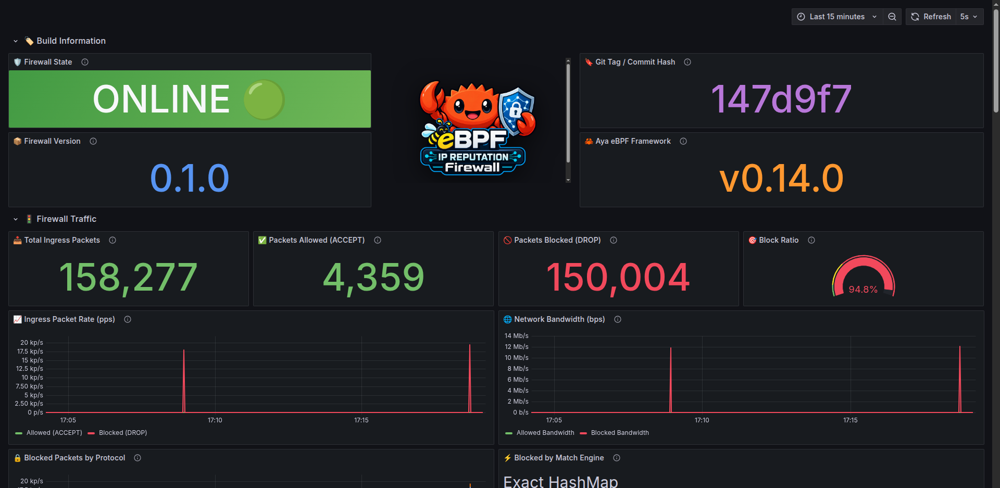

#### 🌐 2. FireHOL Threat Intelligence & Automated Cron Scheduler
Monitors active FireHOL rules loaded into kernel eBPF maps, community threat feeds, automated cron sync status, execution latencies (Git fetch, parallel Rayon parsing, eBPF map installation), and real-time blocked traffic broken down by FireHOL threat categories (*Attacks*, *Malware*, *Botnets*, *Spam*, *Proxies*).

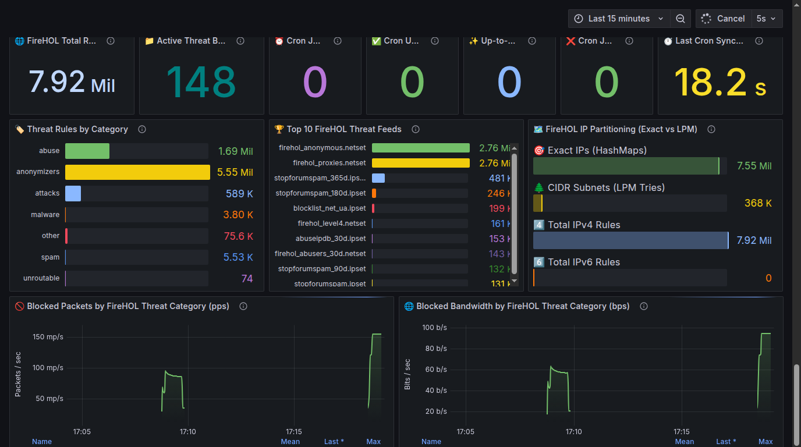

#### 🎯 3. Top 100 Blocked Attackers & Threat Intelligence
Exposes active threat actors currently tracked in the bounded Top 100 list, including cumulative drop volume, real-time discard rates, and protocol distribution.

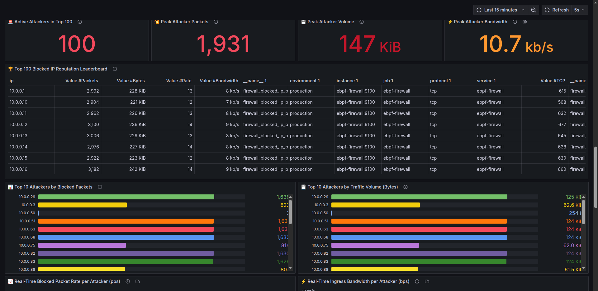

#### 🏆 4. Top 100 Blocked IP Reputation Leaderboard
A comprehensive sortable table providing deep threat visibility for every IP in the Top 100 list with pagination, visual gauges, and protocol columns.

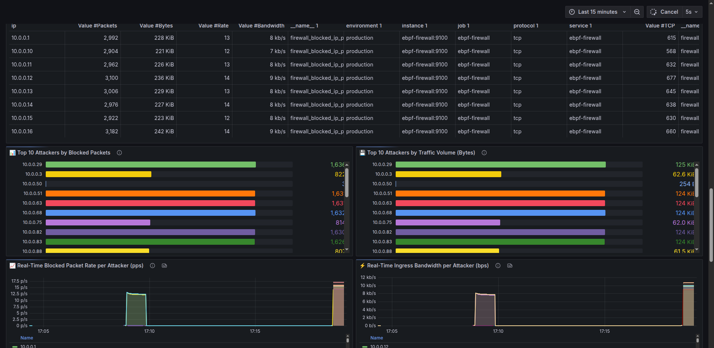

#### 🗺️ 5. eBPF Maps Hierarchy & Rule Distribution
Monitors the internal state of kernel eBPF maps, rule distribution across IPv4 and IPv6, Ring Buffer event ingestion rate, and error counters.

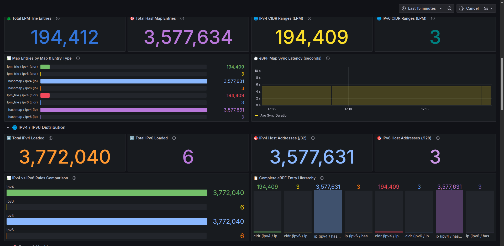

#### 🗄️ 6. RocksDB Cache & FireHOL Import Metrics
Visualizes the on-disk LZ4 RocksDB cache used to keep heavy FireHOL metadata out of RAM, alongside import pipeline performance: RocksDB logical batch bytes written, files processed, import entries/sec, write-stage latency, and parsing vs. RocksDB write throughput.

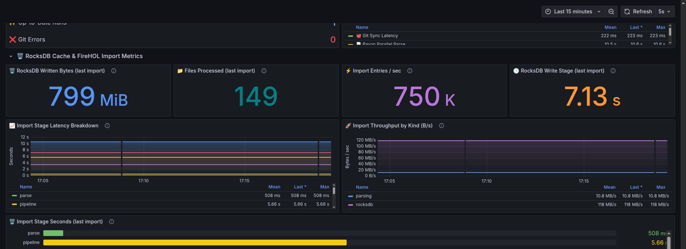

<details>
<summary>🔍 <b>Click to expand full end-to-end dashboard panorama</b></summary>

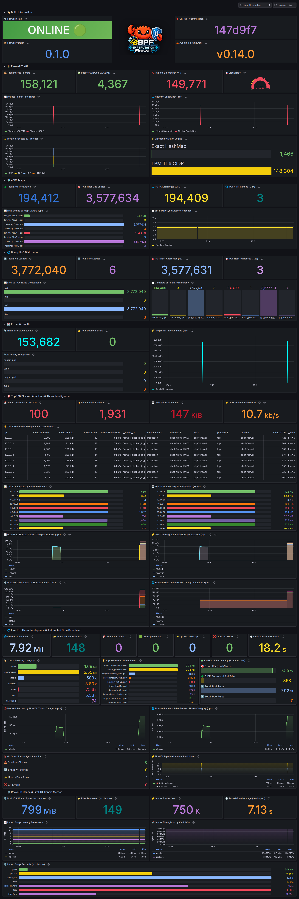

</details>

---

## 🐳 Docker Compose Deployment

### 1. 🌐 Network Topology & Services

The containerized environment provides an isolated virtual testbed connecting the firewall, traffic generator, Prometheus scraper, and Grafana dashboard on a dedicated bridge network (`firewall-net`: `172.28.0.0/16`):

<p align="center">
  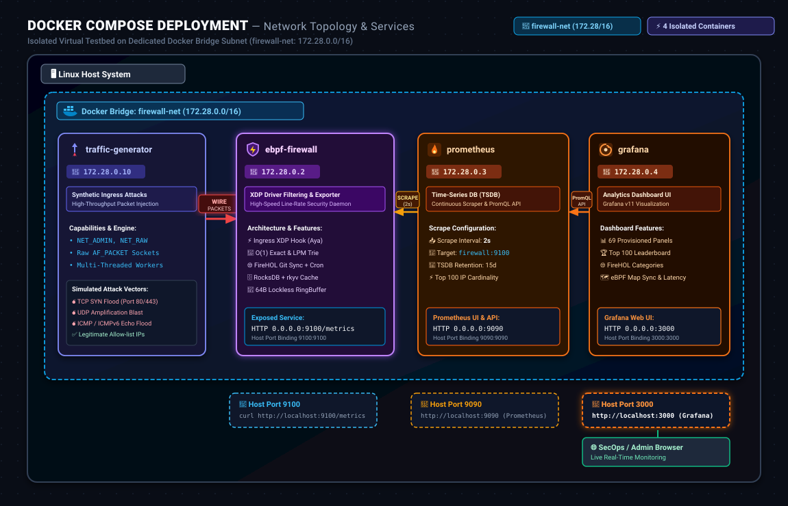
</p>

<details>
<summary>👁️ <b>Click to view Mermaid diagram source</b></summary>

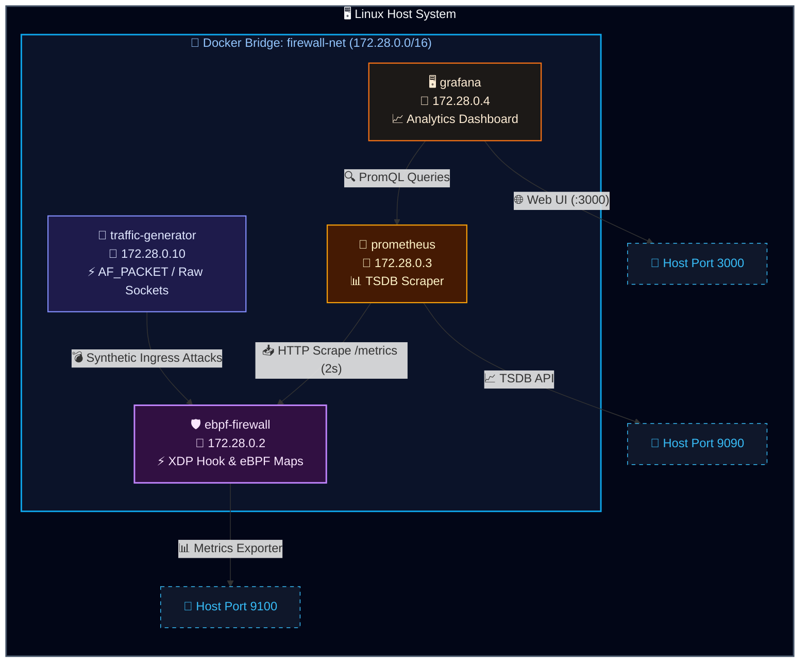

</details>

| Container 🐳 | Service | Subnet IP 🏷️ | Exposed Port 🔌 | Role & Description 📋 |
| :--- | :--- | :--- | :--- | :--- |
| **`ebpf-firewall`** | `firewall` | `172.28.0.2` | `9100:9100` | High-performance eBPF XDP Firewall daemon & Prometheus HTTP metrics exporter |
| **`prometheus`** | `prometheus` | `172.28.0.3` | `9090:9090` | Prometheus v3 time-series database scraping `172.28.0.2:9100/metrics` every 2 seconds |
| **`grafana`** | `grafana` | `172.28.0.4` | `3000:3000` | Grafana 11 analytics UI pre-provisioned with Prometheus datasource & dashboards |
| **`traffic-generator`** | `traffic-generator` | `172.28.0.10` | N/A | High-speed synthetic traffic generator with `NET_ADMIN` & `NET_RAW` capabilities |

---

### 2. 📋 Environment Variables in `docker-compose.yml`

```yaml
services:
  firewall:
    environment:
      - NO_COLOR=false
      - FIREWALL_NO_COLOR=false
      - RUST_LOG=info,firewall=info
      - FIREWALL_IFACE=eth0
      - FIREWALL_RULES=/app/rules/blocklist.txt,/app/rules/blocklist_v6.txt,/app/rules/cidr_ranges.txt
      - METRICS_LISTEN_ADDRESS=0.0.0.0:9100
      - FIREHOL_UPDATE_CRON=0 0 * * * *
      - FIREWALL_FIREHOL_CACHE_DIR=/app/cache/firehol
```

### 3. 🚀 Quickstart Commands

```bash
# 🏗️ Build all containers (with BuildKit dependency caching)
make docker-build

# 🚀 Start all services in the background
make docker-up

# 🛡️ Run end-to-end multi-protocol traffic verification
make test-traffic

# ⚡ Run line-rate packet injection benchmark
make bench BENCH_ARGS="--duration 10s --connections 500"

# 🛑 Stop all containers
make docker-down
```

---

## ⚡ Performance & XDP Modes

### 🔌 XDP Attach Modes

| Mode 🔌 | CLI Flag ⚙️ | Where Executed 📍 | Performance 🚀 | Requirements 📋 |
| :--- | :--- | :--- | :--- | :--- |
| **Driver / Native** | `--mode driver` | Network interface driver RX ring | **Maximum** (~15-40 Mpps/core) ⚡ | Driver support (e.g. `ixgbe`, `i40e`, `mlx5`, `virtio-net`) |
| **Generic / SKB** | `--mode generic` | Linux network stack early ingress | **High** (~2-5 Mpps/core) 🏎️ | Works on **any** Linux interface (including `lo`, `veth`, Docker) |
| **Hardware** | `--mode hardware` | SmartNIC ASIC / FPGA | **Extreme** (Wire-speed offload) 🛰️ | Supported SmartNIC (Netronome, Intel, AMD) |
| **Auto** (Default) | `--mode auto` | Tries Driver first, falls back to Generic | **Optimal** 🎯 | Automatic fallback with zero manual configuration |

### 🏎️ Key Optimizations Implemented

1. 🎯 **Dual-Tier Matching Hierarchy**:
   - ~95% of reputation threat feeds consist of discrete host IPs. Storing these in `BPF_MAP_TYPE_HASH` guarantees $O(1)$ constant-time lookup.
   - Aggregate CIDR prefixes are evaluated in `BPF_MAP_TYPE_LPM_TRIE` only when the exact match does not trigger.
2. 🛡️ **Bounds-Check Elision for Verifier Compliance**:
   - Uses an inlined `ptr_at<T>` helper to satisfy eBPF verifier memory safety guarantees with minimal branch overhead.
3. ⚡ **Unaligned Memory Handling**:
   - Ethernet headers are 14 bytes, causing IPv4 headers to start at a 2-byte boundary. Using `core::ptr::read_unaligned` guarantees safe code generation accepted by the Linux verifier on x86_64 and AArch64.
4. 📬 **Lockless Ring Buffer**:
   - Uses `BPF_MAP_TYPE_RINGBUF` (Linux 5.8+), eliminating per-CPU memory duplication and atomic cross-CPU locks.
5. 📐 **Exact 64-Byte Event Alignment**:
   - `PacketLogEvent` matches the 64-byte L1 CPU cache line size, maximizing bus efficiency and eliminating false sharing.

---

### 🗄️ FireHOL Import Memory & Zero-Copy Architecture

FireHOL uses `cache/firehol` as its RocksDB directory by default (configurable via `--firehol-cache-dir` or `FIREWALL_FIREHOL_CACHE_DIR`). Placing it on a fast NVMe/SSD is recommended for large datasets.

The import engine streams parsed entries to disk in batches of 4,096 across up to eight parallel workers, keeping only compact rule indices in RAM. Full metadata contexts reside in RocksDB and are read lazily when formatting Ring Buffer audit events.

#### Zero-Copy Mechanics via rkyv:
- **Direct Pinned Slice Traversal**: Point lookups from RocksDB borrow pinned byte slices directly. [rkyv](https://github.com/rkyv/rkyv) accesses `ArchivedFireholMetadata` and `ArchivedRuleBlockContext` directly within these slices without allocating intermediate objects or decoding fields into heap structures.
- **Zero Allocations on Read Path**: Deserialization is a compile-time validated zero-allocation cast (`rkyv::access`).
- **Bounded Write Buffering**: Column families share a 32 MiB block cache and 8 MiB write buffers, strictly bounding total RSS during massive 1,000,000+ rule synchronizations.

#### Import Memory Profile (1,000,000 Distinct IP Entries):

| Implementation | Peak RSS | Elapsed Time |
| :--- | :---: | :---: |
| Legacy in-memory implementation | 328 MiB | 24.2 s |
| Streaming import (unoptimized) | 99 MiB | 21.4 s |
| **Streaming import with RocksDB + rkyv zero-copy** | **99 MiB** | **20.5 s** |

---

## 📜 License

Dual-licensed under either of:
- [Apache License, Version 2.0](LICENSE-APACHE)
- [MIT License](LICENSE-MIT)
